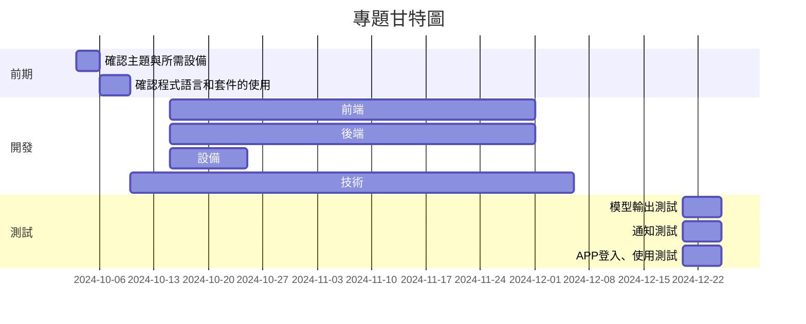
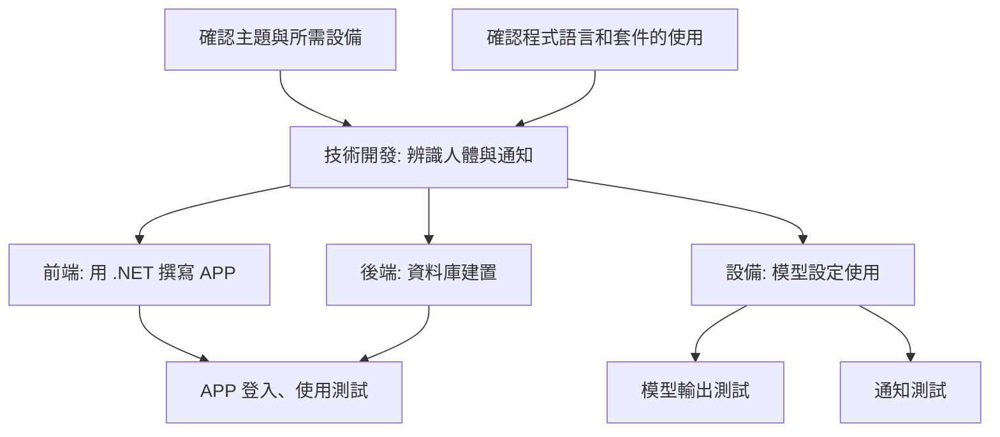

```mermaid
gantt
    title 專題甘特圖
    dateFormat  YYYY-MM-DD
    section 前期
    確認主題與所需設備  :a1, 2024-10-03, 3d
    確認程式語言和套件的使用  :a2, after a1, 4d

    section 開發
    前端: 用 .NET 撰寫 APP :b1, 2024-10-15, 47d
    後端: 資料庫建置  :b2, 2024-10-15, 47d
    設備: 訓練模型設定使用 :b4, 2024-10-15, 10d
    技術: 各項模型辨識  :b3, 2024-10-10, 57d

    section 測試
    模型輸出測試  :c1, 2024-12-20, 5d
    通知測試  :c2, 2024-12-20, 5d
    APP登入、使用測試  :c3, 2024-12-20, 5d
```

```mermaid
graph TD;
    A[確認主題與所需設備]-->C[技術開發: 模型訓練];
    B[確認程式語言和套件的使用]-->C[技術開發: 辨識人體與通知];
    C[技術開發: 辨識人體與通知]-->D[前端: 用 .NET 撰寫 APP];
    C[技術開發: 辨識人體與通知]-->E[後端: 資料庫建置];
    C[技術開發: 辨識人體與通知]-->F[設備: 模型設定使用];
    D[前端: 用 .NET 撰寫 APP]-->I[APP 登入、使用測試];
    E[後端: 資料庫建置]-->I[APP 登入、使用測試];
    F[設備: 模型設定使用]-->G[模型輸出測試];
    F[設備: 模型設定使用]-->H[通知測試]; 
```

## 關鍵路徑: A 確認主題與所需設備 → B 確認程式語言和套件的使用 → C 技術開發: 辨識人體與通知 → D 前端: 用 .NET 撰寫 APP → G 模型輸出測試/I APP 登入、使用測試（H 通知測試）
