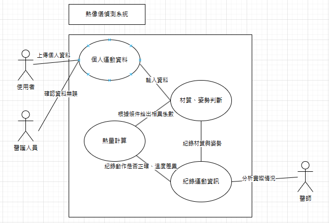
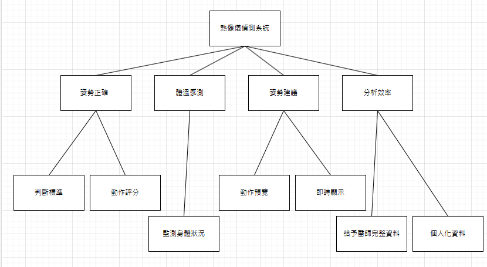

# 功能性需求
1. 偵測使用者的動作姿勢及衣服材質 
2. 判斷使用者內容正確性，並給出相異係數 
3. 計算使用者動作得分 
4. 給予動作分數及運動建議 

# 非功能性需求
1. 可擴展性，能運用到多項運動使用者中 
2. 安全性，每個使用者都有獨立的分數資料庫 
3. 精確性，判斷不同姿勢分數 
4. 使用便捷性，網頁呈現簡單直觀 

### 使用案例圖

### 功能分解圖 (FDD)

